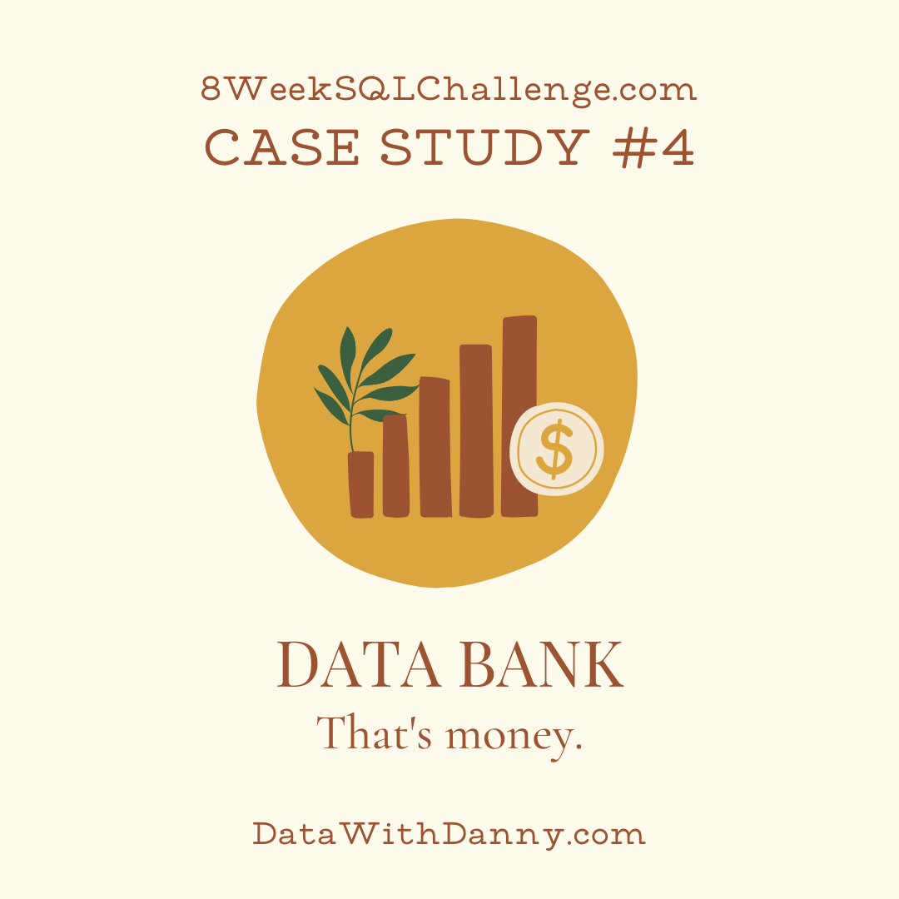
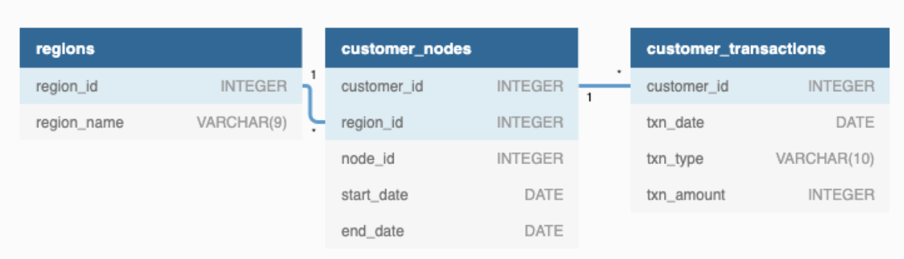

# Case Study #4 - Data Bank


## Table of Contents

* [Datasets & ERD](#datasets)
* [A. Customer Nodes Exploration](#a)
* [B. Customer Transactionss](#b)
* [C. Data Allocation Challenge](#c)
* [D. Extra Challenge](#d)

## <a id = 'datasets'></a> Datasets & ERD

Please run the [schema query](./case4_schema.sql) to create the Datasets.

This case study provides three tables: `regions`, `customer_nodes`, `customer_transactions`<br>




<details>
  <summary> regions </summary>

| region_id | region_name |
|-------------|-------------|
| 1           | Australia   |
| 2           | America     |
| 3           | Africa      |
| 4           | Asia        |
| 5           | Europe      |

</details>

<details>
  <summary> customer_nodes </summary>

  | customer_id | region_id | node_id | start_date | end_date   |
|---------------|-----------|---------|------------|------------|
| 1             | 3         | 4       | 2020-01-02 | 2020-01-03 |
| 2             | 3         | 5       | 2020-01-03 | 2020-01-17 |
| 3             | 5         | 4       | 2020-01-27 | 2020-02-18 |
| 4             | 5         | 4       | 2020-01-07 | 2020-01-19 |
| 5             | 3         | 3       | 2020-01-15 | 2020-01-23 |
| 6             | 1         | 1       | 2020-01-11 | 2020-02-06 |
| 7             | 2         | 5       | 2020-01-20 | 2020-02-04 |
| 8             | 1         | 2       | 2020-01-15 | 2020-01-28 |
| 9             | 4         | 5       | 2020-01-21 | 2020-01-25 |
| 10            | 3         | 4       | 2020-01-13 | 2020-01-14 |
| 11            | 2         | 5       | 2020-01-19 | 2020-01-25 |
| 12            | 1         | 2       | 2020-01-13 | 2020-01-14 |
| 13            | 2         | 3       | 2020-01-02 | 2020-01-14 |
| 14            | 1         | 2       | 2020-01-25 | 2020-01-25 |
| 15            | 1         | 3       | 2020-01-25 | 2020-02-08 |
| 16            | 4         | 4       | 2020-01-13 | 2020-01-18 |
| 17            | 2         | 3       | 2020-01-19 | 
...etc

</details>

<details>
  <summary> customer_transactions </summary>

| customer_id | txn_date   | txn_type | txn_amount |
|---------------|------------|----------|------------|
| 429           | 2020-01-21 | deposit  | 82         |
| 155           | 2020-01-10 | deposit  | 712        |
| 398           | 2020-01-01 | deposit  | 196        |
| 255           | 2020-01-14 | deposit  | 563        |
| 185           | 2020-01-29 | deposit  | 626        |
| 309           | 2020-01-13 | deposit  | 995        |
| 312           | 2020-01-20 | deposit  | 485        |
| 376           | 2020-01-03 | deposit  | 706        |
| 188           | 2020-01-13 | deposit  | 601        |
| 138           | 2020-01-11 | deposit  | 520        |
| 373           | 2020-01-18 | deposit  | 596        |
| 361           | 2020-01-12 | deposit  | 797        |
| 169           | 2020-01-10 | deposit  | 628        |
| 402           | 2020-01-05 | deposit  | 435        |
| 60            | 2020-01-19 | deposit  | 495        |
| 378           | 2020-01-07 | deposit  | 193        |
  ...etc
</details>

## Case Study Questions

### <a id = 'a'></a> A. Customer Nodes Exploration

#### 1. How many unique nodes are there on the Data Bank system?

```sql
select count(distinct node_id) as node_unique
from customer_nodes
```
| node_unique |
|---------------|
| 5           |

- Use `distinct` to count unique nodes.

#### 2. What is the number of nodes per region?

```sql
select region_name, count(distinct node_id) as node_counts
from customer_nodes n
inner join regions r on n.region_id = r.region_id
group by region_name
```
| region_name | node_counts |
|---------------|-------------|
| Africa        | 5           |
| America       | 5           |
| Asia          | 5           |
| Australia     | 5           |
| Europe        | 5           |

- Join regions to get names.

#### 3. How many customers are allocated to each region?
```sql
select region_name, count(customer_id) as customer_counts
from customer_nodes n
inner join regions r on n.region_id = r.region_id
group by region_name
```

| region_name | customer_counts |
|---------------|-------------|
| Africa        | 714         |
| Europe        | 616         |
| Australia     | 770         |
| America       | 735         |
| Asia          | 665         |

- Count customer_id per regions.
- You only need to change `count()` from the previous query.

#### 4. How many days on average are customers reallocated to a different node?

#### 5. What is the median, 80th and 95th percentile for this same reallocation days metric for each region?

### <a id = 'b'></a> B. Customer Transactions

#### 1. What is the unique count and total amount for each transaction type?

#### 2. What is the average total historical deposit counts and amounts for all customers?

#### 3. For each month - how many Data Bank customers make more than 1 deposit and either 1 purchase or 1 withdrawal in a single month?

#### 4. What is the closing balance for each customer at the end of the month?

#### 5. What is the percentage of customers who increase their closing balance by more than 5%?

### <a id = 'c'></a> C. Data Allocation Challenge

### <a id = 'd'></a> D. Extra Challenge